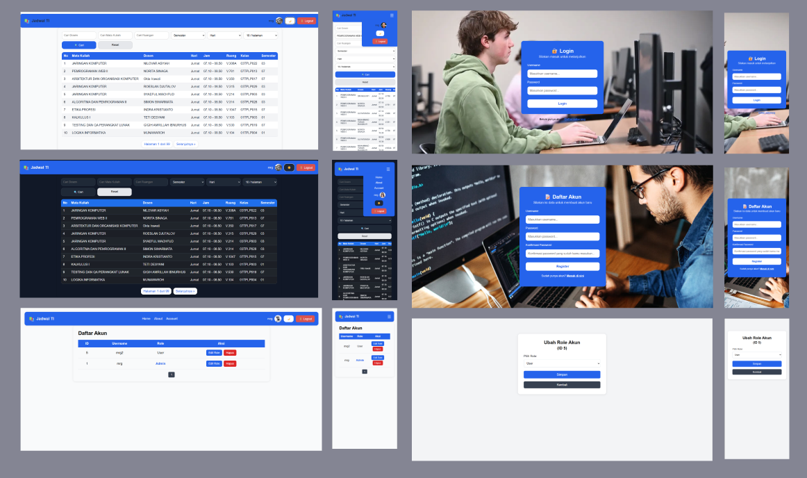

# Simple Jadwal


Ini adalah aplikasi jadwal kuliah berserta penggunaan ruangan jurusan TI universitas pamulang yang saya buat untuk tugas pemrograman 2. Untuk tampilan aplikasi dibangun diatas php dengan styling CSS murni dan vanila javascript. Aplikasi ini menggunakan api yang juga saya buat dan dapat digunakan secara public. Data yang ada pada aplikasi ini saya dapat dari scraping jadwal kuliah yang ada di aplikasi my unpam. Karena pada jadwal kuliah yang ada pada aplikasi my unpam tidak ada filter atau pencarian jam dosen dan kelas, maka saya buat alikasi ini.

## Akses Langsung

https://newjadwalit.raffimrg.my.id/login.php

## Fitur Utama

1. **Register**

   - Pengguna baru dapat mendaftar dengan mengisi informasi yang diperlukan.

2. **Login**

   - Pengguna dapat masuk ke aplikasi menggunakan kredensial yang telah terdaftar.

3. **Dashboard**

   - Halaman utama setelah login yang menampilkan informasi penting terkait jadwal.

4. **About**

   - Halaman yang memberikan informasi tentang aplikasi.

5. **List Account**

   - Menampilkan daftar akun pengguna yang terdaftar di aplikasi.

6. **Edit Role**
   - Admin dapat mengubah peran pengguna untuk mengatur hak akses.

## Instalasi

1. **Clone**

```bash
git clone https://github.com/raffiMRG/simple-jadwal.git
```

2. **Masuk Ke Folder Config**

```bash
cd simple-jadwal\scrapFrontend\config
```

3. **Edit Config**

buka `config.php` kemudian sesuaikan dengan API yang digunakan. contoh API saat ini

```bash
$API_URL = "https://apijadwal.raffimrg.my.id";
```

4. **Selesai**

Silahkan buka aplikasi di web browser
